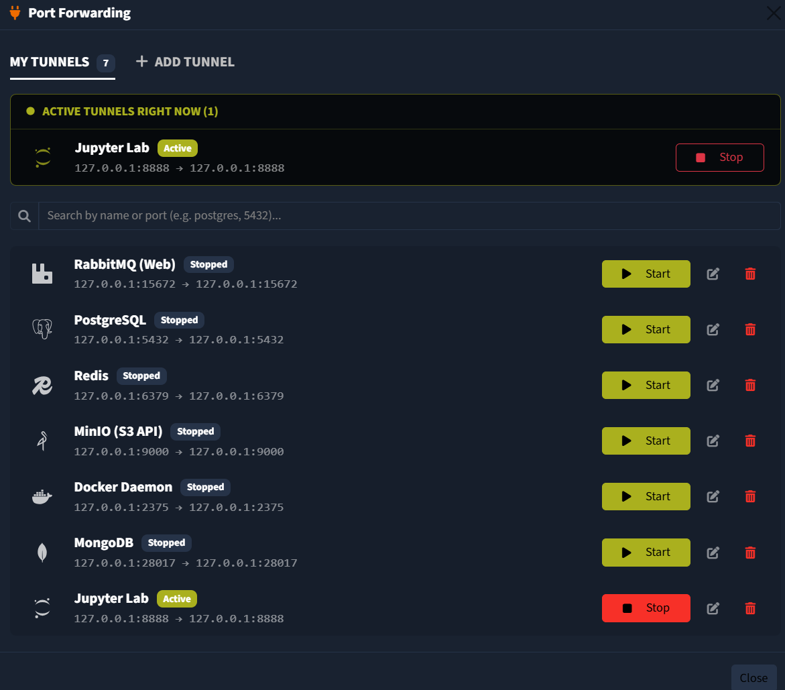
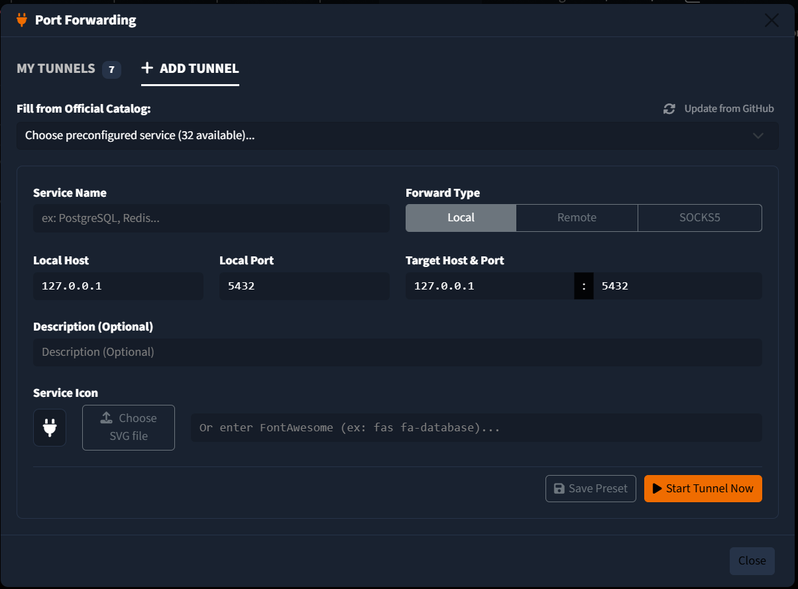
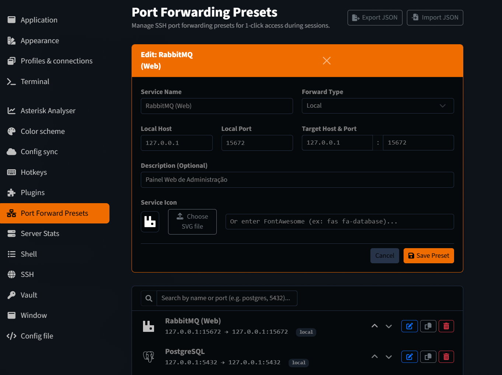

# Tabby Quick Port Forward

SSH Port Forwarding management plugin for [Tabby Terminal](https://tabby.sh).

Repository: [https://github.com/codewiw/tabby-quick-port-forward](https://github.com/codewiw/tabby-quick-port-forward)

Provides reusable port forwarding presets with authentic brand icons and one-click connection toggling for active SSH sessions.

## Screenshots

### Port Forwarding Manager


### Adding a New Preset from Catalog


### Settings and Preset Library


## Features

- **One-Click Tunnels**: Start and stop port forwards directly on the active SSH session.
- **Service Catalog**: Includes official monochrome vector icons and default ports for 30+ popular database, messaging, observability, and DevOps services.
- **GitHub Catalog Sync**: Built-in synchronization to fetch and update service presets directly from GitHub.
- **Customizable Services**: Add, edit, duplicate, or reorder presets with custom SVG icons or FontAwesome classes.
- **Native SSH Toolbar Integration**: Intercepts the native Tabby "Ports" button on the terminal toolbar without adding clutter to the window titlebar.
- **Configuration Dashboard**: Manage presets, backup, and restore configurations via JSON import and export in Tabby Settings.

## Installation

### Via Tabby Plugin Manager (Recommended)
1. In Tabby, open **Settings** > **Plugins**.
2. Search for `tabby-quick-port-forward`.
3. Click **Install** and restart or reload Tabby (`Ctrl + Shift + R`).

### Manual Installation
Clone this repository into Tabby's plugin directory:

**Windows (PowerShell):**
```powershell
cd "$env:APPDATA\tabby\plugins\node_modules"
git clone https://github.com/codewiw/tabby-quick-port-forward.git
cd tabby-quick-port-forward
npm install --production
```

**Linux / macOS:**
```bash
cd ~/.config/tabby/plugins/node_modules
git clone https://github.com/codewiw/tabby-quick-port-forward.git
cd tabby-quick-port-forward
npm install --production
```

## Usage

1. Open any SSH session tab in Tabby.
2. Click the **Ports** button on the bottom terminal toolbar.
3. In the modal:
   - **My Tunnels**: Start or stop configured tunnels with one click.
   - **Add Tunnel**: Select a service from the official catalog or define custom parameters (Host, Local Port, Target Port, Icon).
   - **Edit Tunnel**: Modify existing tunnel definitions in a dedicated tab without interrupting workflow.

## License

This project is licensed under the [MIT License](LICENSE).
